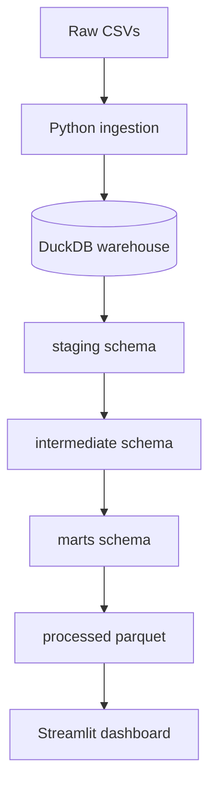

# Saas Revenue Intelligence

An end-to-end Saas analytics project that models subscription revenue, churn, cohort retention, support impact, and product usage using analytics workflow.

## Business Problem

## Dataset
This project is designed for the Rivalytics / RavenStack SaaS Subscription & Churn Analytics dataset.
Download the raw dataset and place the csv files in `data/raw/`.

## Planned Architecture


## Run Locally

```bash
uv venv
uv pip install -r requirements.txt
uv run python scripts/check_environment.py
```
