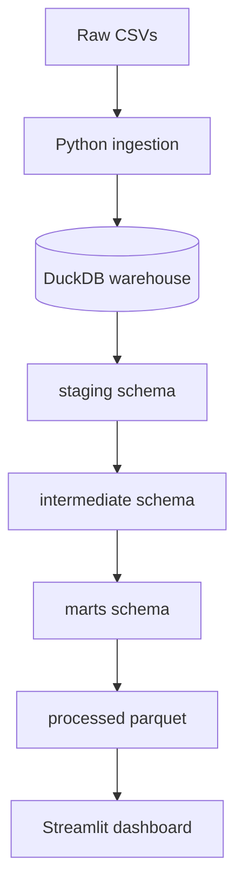
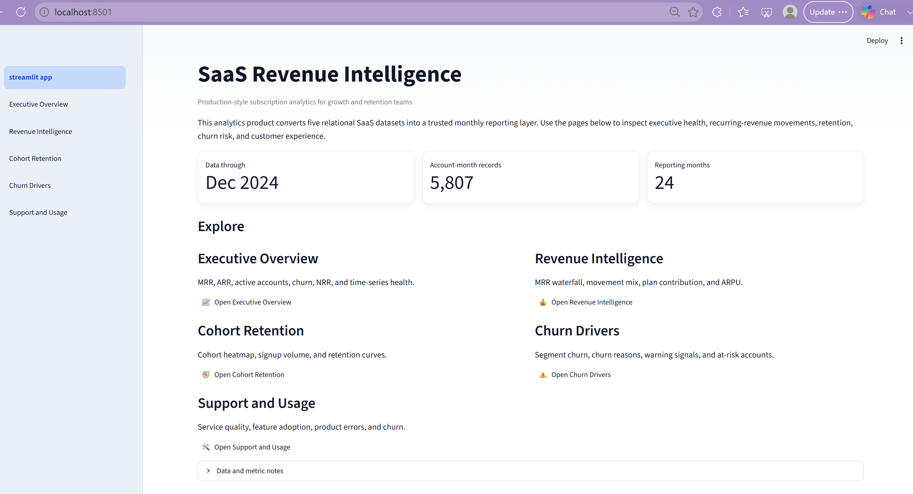
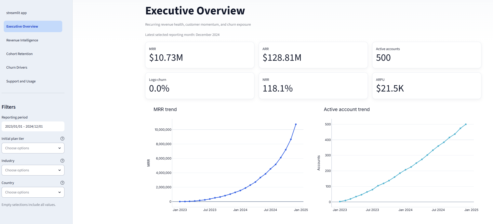
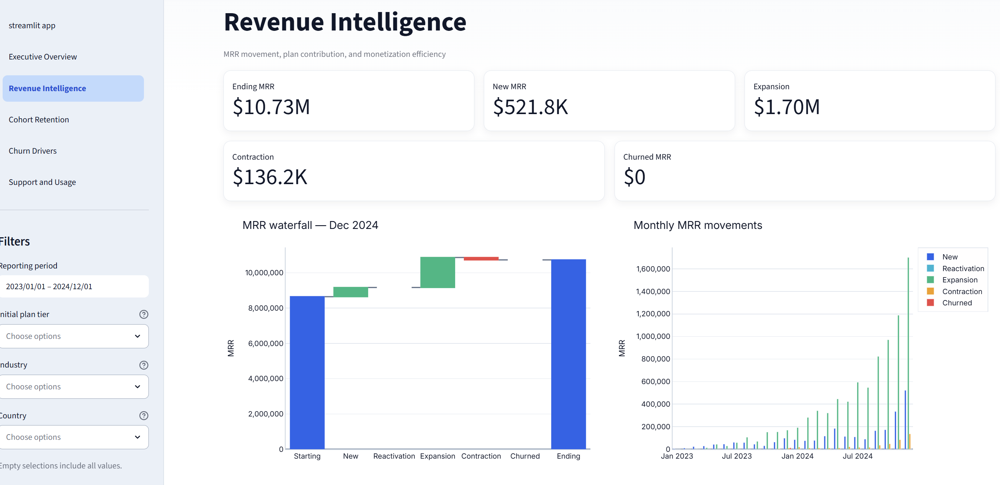
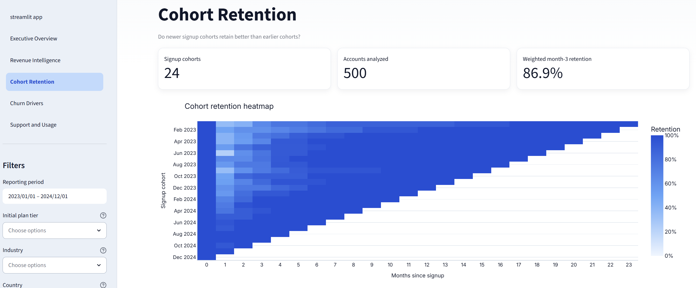
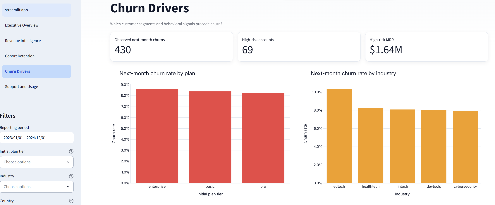

# Saas Revenue Intelligence

An end-to-end Saas analytics project that models subscription revenue, churn, cohort retention, support impact, and product usage using analytics workflow.

## Executive Summary

This project models MRR movement, logo churn, net revenue retention, cohort retention, support quality, and product usage for a synthetic B2B SaaS company. As of December 2024 the modeled book shows **$10.73M MRR**, **$128.81M ARR**, **500 active accounts**, and **118.1% NRR**, with growth driven primarily by expansion rather than new logo acquisition.

## Business Problem
SaaS leaders need one trusted answer to:

- Is recurring revenue growing for the right reasons?
- Where is churn concentrated by tenure, plan, and industry?
- Do support failures and weak product adoption precede churn?
- Which cohorts retain, and what should Customer Success do next?

This repository answers those questions with layered SQL metrics, automated tests, and a five-page analytics product.

## Dataset
This project is designed for the Rivalytics / RavenStack SaaS Subscription & Churn Analytics dataset.
Download the raw dataset and place the csv files in `data/raw/`.
Source: [Rivalytics / RavenStack SaaS Subscription & Churn Analytics](https://www.kaggle.com/datasets/rivalytics/saas-subscription-and-churn-analytics-dataset) (synthetic).

## Planned Architecture


## Metric Definitions

Core formulas live in [`docs/metric_definitions.md`](docs/metric_definitions.md).

| Metric | Definition |
|---|---|
| **MRR** | Sum of active subscription MRR in the month |
| **ARR** | MRR × 12 |
| **Logo churn** | Churned accounts ÷ prior active accounts |
| **NRR** | `(starting + expansion − contraction − churned) / starting` |
| **ARPU** | Total MRR ÷ active accounts |
| **Cohort retention** | Retained accounts ÷ signup-cohort size |

## Dashboard Screenshots











## Key Findings

Full write-up: [`docs/business_findings.md`](docs/business_findings.md)

**Finding 1: Growth is expansion-led.**  
Across the modeled window, expansion MRR (`$8.63M`) outpaced new MRR (`$2.55M`) by more than 3×. Average NRR is **119%**.

**Finding 2: Recorded churn concentrates early.**  
**64.4%** of recorded churn events occur in the first six months after signup.

**Finding 3: Edtech is the highest-risk industry.**  
Next-month churn rate is **10.3%** in edtech versus ~8% in other industries.

**Finding 4: Product gaps dominate stated churn reasons.**  
Top coded reasons are **features (105)**, **budget (102)**, and **support (92)**.

**Finding 5: SLA breaches are a useful warning signal.**  
Account-months with an SLA breach show **9.9%** next-month churn versus **8.3%** without a breach.

## Business Recommendations

1. Run a 30/60/90-day onboarding health check for accounts with low feature adoption in months 0–2.
2. Prioritize Customer Success outreach for high-MRR accounts with usage declines, SLA breaches, or high-priority tickets.
3. Investigate edtech onboarding and packaging separately from other verticals.
4. Treat feature gaps and support experience as product and CX roadmap inputs, not only discount levers.
5. Keep expansion motion funded: NRR above 100% means existing-customer monetization is the primary growth engine.

## Limitations

- The Rivalytics dataset is **synthetic**, so findings demonstrate analytic method rather than real-company truth.
- Logo churn events and subscription end dates are not always perfectly aligned, so MRR churn and event churn should be interpreted as complementary signals.
- The at-risk score is an **explainable prioritization heuristic**, not a trained predictive model.
- Dashboard performance depends on precomputed Parquet exports; rebuild with `make pipeline` after data changes.

## Run Locally

```bash
uv venv
uv pip install -r requirements.txt
uv run python scripts/check_environment.py
```
