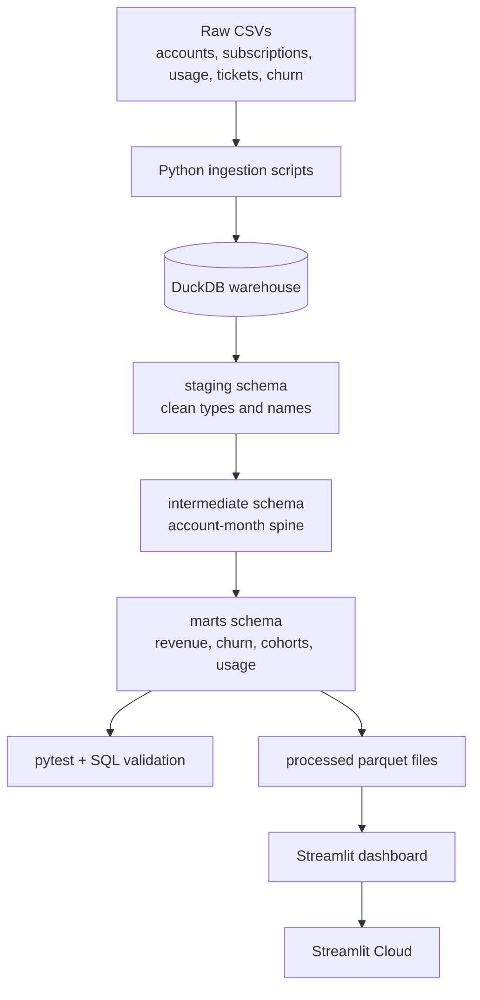

# Architecture

The project follows a production-style analytics architecture: raw source files are ingested into DuckDB, transformed through SQL layers, validated, exported to dashboard-ready files, and served through Streamlit.

##  Proposed System Diagram



## Layer Responsibilities

| Layer | Purpose |
|---|---|
| Raw | Preserve downloaded source tables without business transformations |
| Staging | Clean names, cast types, standardize values, enforce basic quality |
| Intermediate | Build reusable business grains such as account-month |
| Marts | Create KPI-ready facts and dimensions for reporting |
| Exports | Store dashboard-ready Parquet files for fast app loading |
| App | Present metrics, trends, filters, and recommendations |

## Planned Schemas

```text
raw
staging
intermediate
marts
```

## Core Modeling Grain

The most important modeling table will be the account-month spine:

```text
one row per account per calendar month
```

This grain makes MRR movement, churn, cohort retention, support impact, and product usage analysis reliable and repeatable.
