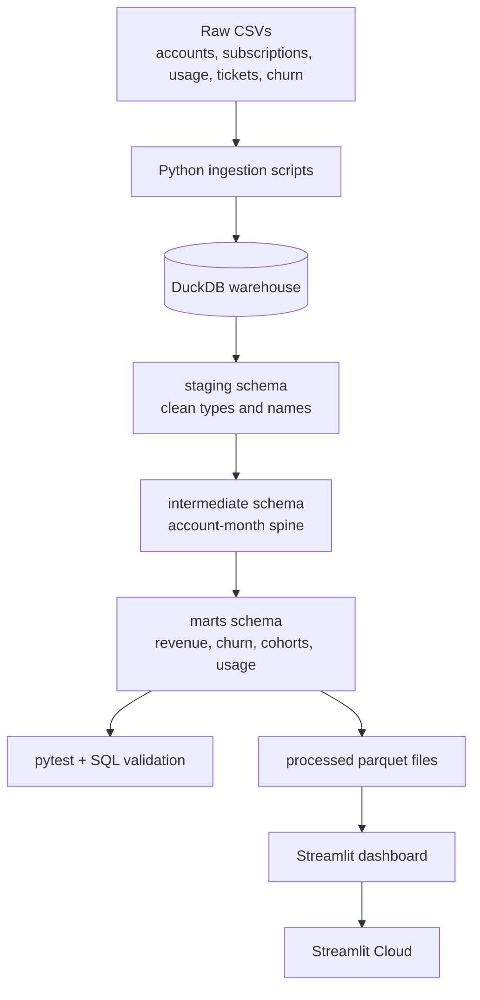

# Architecture

The project follows a production-style analytics architecture: raw source files are ingested into DuckDB, transformed through SQL layers, validated, exported to dashboard-ready files, and served through Streamlit.

##  Proposed System Diagram



## Layer Responsibilities

| Layer | Purpose |
|---|---|
| Raw | Preserve downloaded source tables without business transformations |
| Staging | Clean names, cast types, standardize values, enforce basic quality |
| Intermediate | Build reusable business grains such as account-month |
| Marts | Create KPI-ready facts and dimensions for reporting |
| Exports | Store dashboard-ready Parquet files for fast app loading |
| App | Present metrics, trends, filters, and recommendations |

## Planned Schemas

```text
raw
staging
intermediate
marts
```

## Core Modeling Grain

The most important modeling table is the account-month spine:

```text
one row per account per calendar month
```

This grain makes MRR movement, churn, cohort retention, support impact, and product usage analysis reliable and repeatable.

This grain makes MRR movement, churn, cohort retention, support impact, and product usage analysis reliable and repeatable.

## Runtime Flow

1. `scripts/download_data.py` or `scripts/generate_sample_data.py` populates `data/raw/`.
2. `scripts/build_warehouse.py` executes numbered SQL files in order.
3. `scripts/export_for_app.py` writes five Parquet files into `data/processed/`.
4. `src/pipeline.py` orchestrates build then export.
5. Streamlit pages read Parquet through `src/dashboard.py` and render charts via `src/charts.py`.

## Dashboard Pages

| Page | Business question |
|---|---|
| Executive Overview | Is recurring revenue healthy right now? |
| Revenue Intelligence | What movements explain MRR change? |
| Cohort Retention | Do newer cohorts retain better? |
| Churn Drivers | Which segments and signals precede churn? |
| Support and Usage | How do service quality and adoption relate to retention? |


